# Desafio: Fundamentos de Kubernetes na Prática

#### Objetivo: Demonstrar conhecimento prático nos fundamentos de Kubernetes.

## Nível 1 - Namespace e Primeiro Contato:

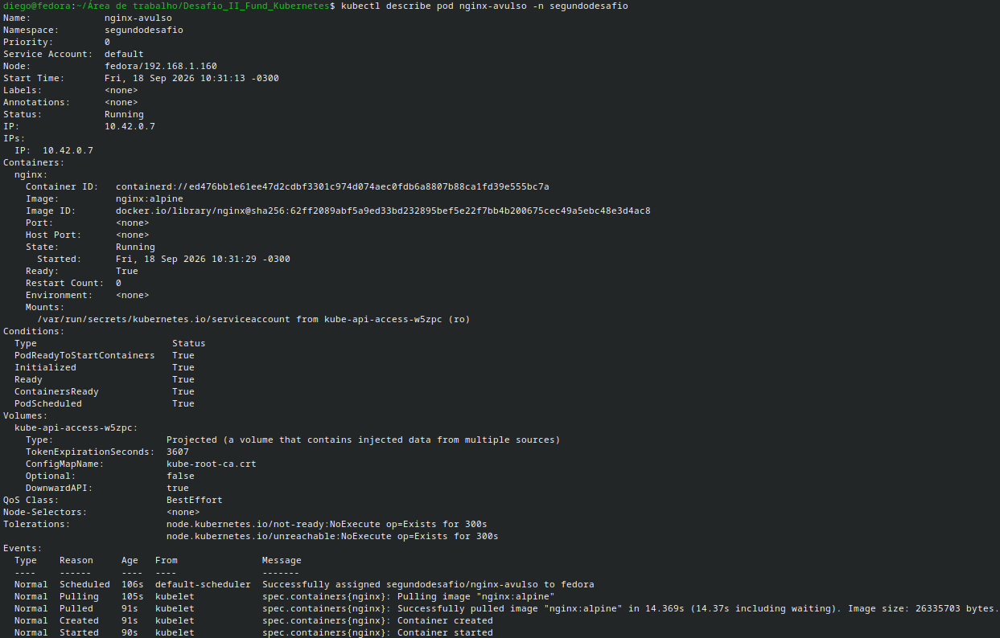
Print 1.1: Inspeção de eventos do Pod de teste inicializado no namespace dedicado.

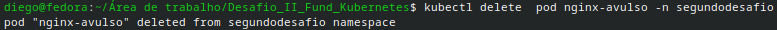
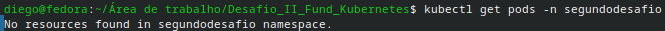
Print 1.2 e 1.3: Terminal mostrando o resultado de "kubectl delete pod...", seguido de "kubectl get pods...", mostrando que não há recursos.

#### Reflexão: Ao deletar o Pod avulso, ele não irá retornar sozinho, pois não existe um controlador, como Deployment, gerenciando seu estado. Isso demonstrar como porque criamos raramente Pods em produção.

## Nível 2 - Banco de Dados com Persistência

Print 2.0: Terminal mostrando a saída do comando "kubectl get pv,pvc,pods -n segundodesafio" e "kubectl get pods -n segundodesafio", comprovando a criação do espaço em memória, de 1GB.

#### Reflexão: A principal diferença é a persistência e o ciclo de vida. Um volume do tipo emptyDir é temporário e está atrelado ao ciclo de vida do Pod; se o Pod for deletado ou falhar, os dados são apagados permanentemente. Já o PVC solicita armazenamento físico real. Se o Pod for deletado, os dados permanecem intactos no disco físico e são reconectados automaticamente quando o Pod for recriado.

## Nível 3 - ConfigMap e Secrets
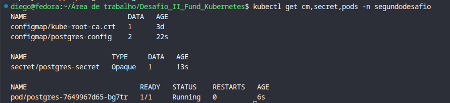
Print 3.0: Validação da criação do configmap/postgres-config, secret/postgres-secret e reinicialização limpa do Deployment do PostgreSQL utilizando referências seguras (configMapKeyRef e secretKeyRef).

#### Boas práticas:
* ConfigMap: Armazena dados de configuração não sensíveis em texto claro (POSTGRES_DB, POSTGRES_USER), permitindo reutilização e alteração sem rebuild de imagem.
* Secret: Armazena credenciais confidenciais codificadas em Base64 (c2VuaGExMjM= para a senha do postgres), evitando expor senhas em texto plano no manifesto do Deployment.

#### Reflexão: É apenas codificação, não criptografia. Qualquer pessoa com acesso ao kubectl get secret descodifica a string instantaneamente. Para a segurança real, isso significa que o Secret padrão do Kubernetes por si só não protege contra vazamentos de privilégio no cluster ou acesso indevido ao etcd em claro.

## Nível 4 - A API conectada ao banco (a integração)
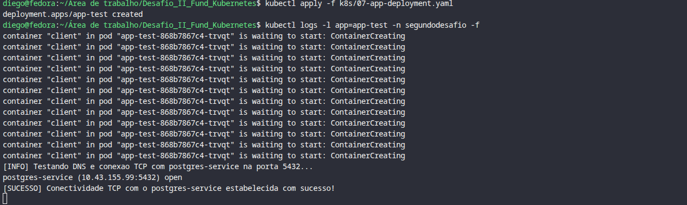
Print 4.0: Print do terminal mostrando a linha [SUCESSO] Conectividade TCP com o postgres-service estabelecida com sucesso!

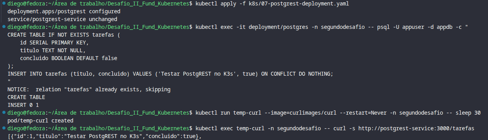
Print 4.1: Comprovação da atualização do deployment do PostgREST, com validação de dados na tabela `tarefas` via `psql` e resposta HTTP JSON via Service DNS interno.

#### Reflexão: Os IPs dos Pods são temporários e mudam sempre que o Pod reinicia. Usar um IP fixo causaria falha se o Pod do banco fosse recriado. O Service (postgres-service) funciona como um endereço DNS estável que encaminha o tráfego automaticamente para o IP atual do Pod ativo.

## Nível 5 - Expor a API e provar a persistência
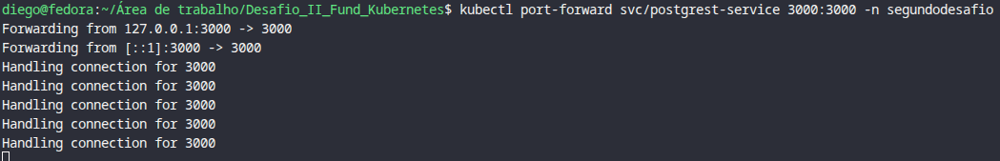
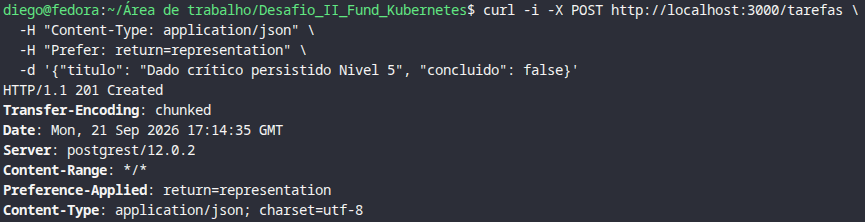
Print 5.0 e 5.1: port-forward ativo na porta 3000 e pedido POST retornando HTTP/1.1 201 Created ao inserir "Dado crítico persistido Nivel 5".

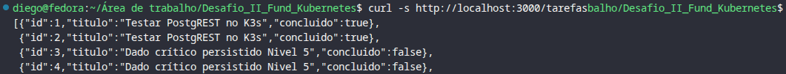
Print 5.2: Listagem confirmando os registos com IDs 1, 2, 3 e 4.

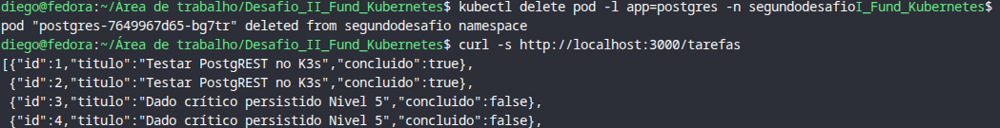
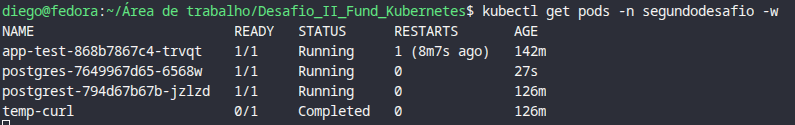
Print 5.3 e 5.4: Remoção manual do Pod postgres-7649967d65-bg7tr e reconciliação automática pelo ReplicaSet gerando o novo Pod postgres-7649967d65-6568w em status Running. Consulta HTTP pós-recovery comprovando a integridade com payload intacto.

#### Reflexão: Para esse dado sobreviver, tiveram que funcionar em conjunto ao menos 6 componentes (PVC/PV, storage, Replica/Deployment, Pod efêmero, Service/CoreDNS, Secret/ConfigMap e a API Postgres). Isso demonstra que o Kubernetes atua como um motor de estado desejado, protegendo a camada de persistência estática.

## Nível 6: Health Checks e escala
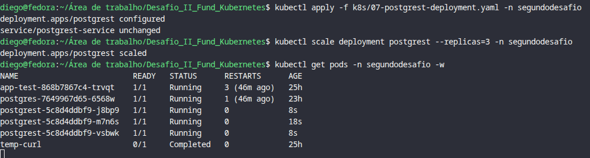
Print 6.0 - Atualização do Deployment com `requests/limits`, `livenessProbe`/`readinessProbe` e escalamento para 3 réplicas do `postgrest` em estado `1/1 Running`
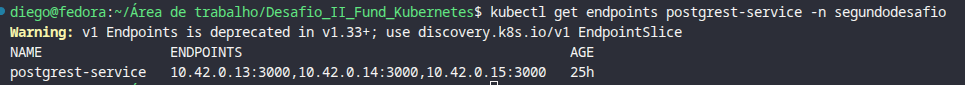
Mapeamento de 3 IPs ativos e prontos para load-balancing round-robin no Service `postgrest-service`: `10.42.0.13:3000`, `10.42.0.14:3000`, `10.42.0.15:3000`.

#### Reflexão: A diferença prática entre liveness e readiness reside na remediação: a livenessProbe valida se a aplicação está viva e reinicia o contêiner em caso de falha persistente, enquanto a readinessProbe valida se o contêiner está apto a aceitar tráfego, removendo o IP do Pod dos Endpoints do Service sem reiniciar o processo se falhar. Escalar a API estateless para várias réplicas é seguro porque cada instância processa pedidos de forma independente sem partilhar estado local, ao passo que escalar um banco relacional com o mesmo volume corromperia os dados, gerando conflitos de bloqueio de transação e quebra de integridade ACID por ausência de replicação clusterizada nativa.